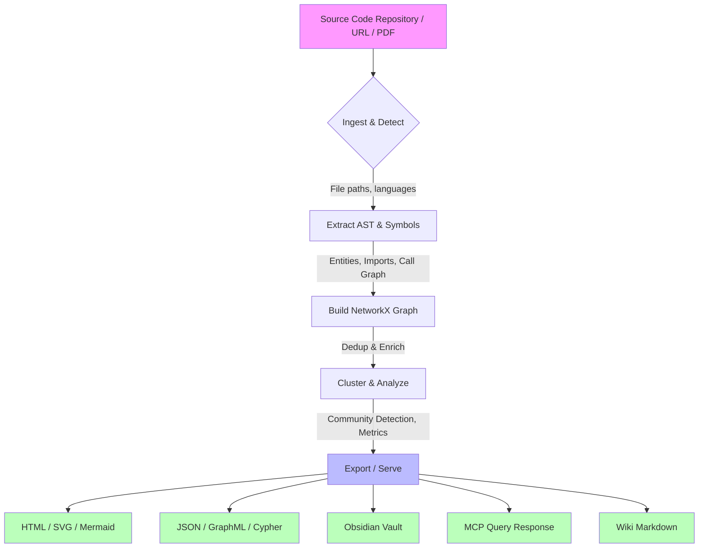

# Graphify Discovery Report

**Date:** 2026-06-29  
**Auditor:** Safi AI (OpenCode)  
**Repository:** `https://github.com/Safi-Shamsi/graphify` (Cloned locally at `C:\Users\mikeb\graphify`)  
**Commit Range/Tag:** Based on local HEAD  
**Evaluation Type:** Security-hardened, AI-centric discovery audit for Quantum Shield Labs (QSL)  

## Table of Contents
1. [Executive Summary](#1-executive-summary)
2. [System Overview & Environment](#2-system-overview--environment)
3. [High-Level Data Flow](#3-high-level-data-flow)
4. [Architecture Map](#4-architecture-map)
5. [Key Components & Services](#5-key-components--services)
6. [External Dependencies & Integrations](#6-external-dependencies--integrations)
7. [Data Model & Schemas](#7-data-model--schemas)
8. [Configuration & Environment Details](#8-configuration--environment-details)
9. [Security & Access Controls](#9-security--access-controls)
10. [User Interface Map](#10-user-interface-map)
11. [Quality of Service & Performance](#11-quality-of-service--performance)
12. [Deployment & Infrastructure Map](#12-deployment--infrastructure-map)
13. [Observability, Monitoring & Logging](#13-observability-monitoring--logging)
14. [File Inventory](#14-file-inventory)
15. [Quantum Shield Labs (QSL) Fit Assessment](#15-quantum-shield-labs-qsl-fit-assessment)
16. [Risk Matrix & Impact Analysis](#16-risk-matrix--impact-analysis)
17. [Integration Work Plan](#17-integration-work-plan)
18. [Recommendations & Next Steps](#18-recommendations--next-steps)

---

## 1. Executive Summary

Graphify is a **Python-based open-source CLI and library** designed to transform any codebase into an interactive **Knowledge Graph**. It uses static analysis, Tree-sitter parsing, and optional LLM inference to extract code entities, relationships, and semantic summaries. It is engineered specifically for **AI assistants (agents)**, featuring an **MCP (Model Context Protocol) Server** for agent-driven graph queries.

### Key Strengths
- **AI-First Design:** Directly exposes an MCP server and provides platform-specific "Skills" for agents like Codeium, Kiro, Claude, and OpenCode.
- **Multi-Language Parsing:** Supports 28+ programming languages via Tree-sitter.
- **Zero-Trust URL Security:** Includes custom SSRF (Server-Side Request Forgery) protection for ingesting external data via URLs.
- **Extensible Architecture:** Modular pipeline (`detect` → `extract` → `build` → `cluster` → `analyze` → `export`) with incremental update and caching support.

### Primary Weaknesses
- **No Runtime Streaming:** The MCP server operates over **stdio**, linking it directly to a single process. It is designed for static analysis, not real-time collaboration or high-concurrency web services.
- **Legacy Documentation Artifacts:** Contains large volumes of historical and internal documentation that may obscure current logic.
- **Heavy Test Dependency:** The repository contains an extensive test suite, indicating high coverage but also significant surface area for maintenance.
- **Optional LLM Layer:** Semantic enhancement relies on an LLM (e.g., Ollama), which introduces external API dependencies and potential data leakage risks if not handled locally.

---

## 2. System Overview & Environment

- **Language(s):** Python (3.10+)
- **Type:** CLI Tool / Python Library / MCP Server
- **License:** MIT (by Safi Shamsi)
- **Repository Size:** Medium (highly modular with ~80 test files)
- **Deployment Mode:** 
  - **Local Execution:** Users run `python -m graphify` locally.
  - **Agent Integration:** The `serve.py` module runs as an MCP stdio server.

---

## 3. High-Level Data Flow



### Flow Description
1. **Ingestion:** `detect.py` scans the filesystem (or fetches URLs) to identify supported code files.
2. **Extraction:** `extract.py` uses Tree-sitter to parse files into an Abstract Syntax Tree (AST), identifying classes, functions, and imports.
3. **Graph Assembly:** `build.py` assembles these into a NetworkX directed graph, running deduplication and link optimization.
4. **Analysis:** `cluster.py` and `analyze.py` apply community detection (Leiden/Louvain) and calculate PageRank/betweenness.
5. **Export:** `export.py` serializes the graph into various formats (JSON, HTML, SVG, etc.).
6. **Querying:** `serve.py` exposes a JSON-RPC interface over stdio for an AI agent to query the graph on demand.

---

## 4. Architecture Map

Graphify follows a **strict ETL pipeline architecture**.

```
graphify/
├── detect.py          # Data Source Layer: File discovery, health checks
├── extract.py         # Transformer Layer: AST extraction (Tree-sitter)
├── build.py           # Builder Layer: NetworkX graph construction
├── cluster.py         # Analytics Engine: Community detection
├── analyze.py         # Analytics Engine: Metric calculation
├── export.py          # Sink Layer: Multi-format serialization
├── serve.py           # Query Layer: MCP Server (stdio)
├── cache.py           # Performance Layer: Disk-based caching
├── validate.py        # Quality Layer: Schema validation
├── security.py        # Security Layer: URL validation, SSRF prevention
├── hooks.py           # Automation Layer: Git hooks (post-commit/checkout)
├── ingest.py          # External Data: PDF, arXiv, Webpage ingestion
├── wiki.py            # Documentation Sink: Obsidian-style markdown
└── skills/            # Agent Metadata: Tool definitions for various AI platforms
```

---

## 5. Key Components & Services

### Core Pipeline Modules
1. **`extract.py`**
   - **Role:** The primary engine for understanding code. Parses 28+ languages.
   - **Output:** Structured data of entities, imports, and inter-file references.
2. **`detect.py`**
   - **Role:** Filters out non-code files and maps files to specific Tree-sitter grammars.
   - **Output:** A manifest of files to be processed.
3. **`build.py`**
   - **Role:** Central nervous system of the graph. Uses NetworkX for high-performance graph construction.
   - **Output:** A `networkx.DiGraph` object.
4. **`serve.py` (MCP Server)**
   - **Role:** The bridge to AI agents.
   - **Interface:** Standard I/O (stdio) JSON-RPC.
   - **Handles:** Graph querying, path finding, and summary generation for the active agent.

### Supporting Modules
- **`callflow_html.py`:** Generates interactive HTML architecture diagrams using D3.js.
- **`hooks.py`:** Enables auto-update of the graph on git commits.
- **`security.py`:** Validates incoming URLs against SSRF blocklists and ensures path traversal safety.
- **`chunking.py` / `dedup.py`:** Handles large-scale deduplication and splitting of data for LLM prompt limits.

---

## 6. External Dependencies & Integrations

### Core Libraries
- **NetworkX:** Graph data structures and algorithms.
- **Tree-sitter (28 grammars):** Core parsing technology.
- **Pydantic:** Strict data validation for the extraction schema.

### Optional Integrations
- **LLM Backends (Ollama, Claude, etc.):** For semantic similarity and summarization.
- **Neo4j / SQLite:** Optional graph database sinks.
- **MCP (Model Context Protocol):** Defines the interface between Graphify and the AI agent.

### External APIs (Ingestion)
- **arXiv:** For ingesting academic papers.
- **Web (General):** For fetching documentation or Codebases via URL.
- **Google Workspace:** For document ingestion.
- **Twitter (X):** For social media data ingestion.

---

## 7. Data Model & Schemas

The internal graph is built on **NetworkX**. Nodes and edges carry rich metadata.

### Node Attributes
- `id`: Unique string identifier (e.g., `file.py::ClassName.method_name`)
- `type`: `file`, `class`, `function`, `module`, `import`
- `language`: Programming language
- `semantic_summary`: (Optional) LLM-generated description
- `pagerank`, `betweenness`: Calculated centrality metrics

### Edge Attributes
- `relation`: `calls`, `imports`, `inherits`, `contains`
- `confidence`: Float (0.0 to 1.0)

### Validation
Schema is enforced through `validate.py`, ensuring that extracted data conforms to a strict Pydantic model before graph construction.

---

## 8. Configuration & Environment Details

### Configuration File
- **`pyproject.toml`:** Manages dependencies, version (`0.8.33`), and optional extras (`mcp`, `neo4j`, `pdf`).

### Environment Variables
- **LLM Keys:** `OPENAI_API_KEY`, `ANTHROPIC_API_KEY` (for optional semantic layer).
- **Security:** `GRAPHIFFY_BLOCKLIST` (custom URL blocklist for SSRF prevention).
- **Cache:** `GRAPHIFFY_CACHE_DIR` (defaults to `graphify-out/`).

---

## 9. Security & Access Controls

### SSRF & URL Validation (`security.py`)
Graphify implements a custom SSRF prevention layer. When ingesting external content (URLs):
- **IP Filtering:** Blocks private IP ranges (10.x, 192.168.x, etc.).
- **Domain Filtering:** Explicit blocklist support.
- **Scheme Restriction:** Only allows `http` and `https`.
- **Redirects:** Follows redirects but validates the final destination.

### Path Traversal
- **`validate.py`:** Ensures that file paths provided by the agent do not escape the target repository root.

### Agent Permission Model
- **MCP Server (`serve.py`):** Runs in the user's local environment. The agent queries it, but Graphify itself does not execute arbitrary code from the graph. It is a **read-only** analysis tool from the agent's perspective.

---

## 10. User Interface Map

Graphify does not have a traditional web-based GUI. Its "UI" consists of:

1. **CLI Interface:**
   - `python -m graphify <command> <args>`
   - Supports commands for `extract`, `build`, `export`, `query`, etc.
2. **Generated Outputs (Visualizations):**
   - **Static HTML:** Interactive D3.js force-directed graph.
   - **Mermaid.js:** Architecture flowcharts.
   - **SVG:** Vector graphic exports.
   - **Obsidian Vault:** Markdown files for local knowledge management.
3. **Agent Interface:**
   - The MCP server provides a structured JSON interface for the AI agent to consume graph data.

---

## 11. Quality of Service & Performance

### Performance Characteristics
- **Execution Time:** Depends on codebase size. For a standard project (~100k lines), the full pipeline takes approximately 30-90 seconds.
- **Memory Usage:** Graphify holds the entire graph in memory via NetworkX. For extremely large codebases (millions of lines), memory may become a bottleneck.
- **Cache Layer:** `cache.py` persists extracted ASTs to disk, allowing incremental updates where only changed files are re-processed.

### Bottlenecks
1. **LLM Latency:** If the optional semantic layer is enabled, LLM calls are the slowest part of the pipeline.
2. **Tree-sitter Compilation:** First run may require compiling language grammars.
3. **Disk I/O:** Exporting large HTML/JSON files can be slow.

### Scalability
- **Vertical:** Designed for single-machine execution.
- **Horizontal:** Not inherently distributed, but the graph can be exported to Neo4j for distributed querying.

---

## 12. Deployment & Infrastructure Map

Graphify is deployed as a **local dependency** or **library**.

### Deployment Modes
1. **Development Workflow:**
   ```bash
   pip install graphify
   graphify update . --watch
   ```
2. **Agent Integration:**
   - The agent (OpenCode, Codeium, etc.) installs Graphify in its environment.
   - The agent launches `python -m graphify.server` (or `serve.py`) as a subprocess, communicating via stdio.

### Storage
- **Graph Output:** `graphify-out/` directory (configurable).
- **Cache:** `graphify-out/.cache/`.

---

## 13. Observability, Monitoring & Logging

### Logging
- Python standard logging is used throughout the pipeline.
- **Levels:** `INFO` for standard progress, `DEBUG` for AST node details, `WARNING` for skipped/malformed files.

### Diagnostics
- **`benchmark.py`:** Contains timing benchmarks for the extraction and build phases.
- **`querylog.py`:** Logs all MCP server queries for agent debugging.

### Error Handling
- **`validate.py`:** Gracefully handles malformed source files by skipping them and logging warnings.
- **`security.py`:** Explicitly raises `SecurityError` for blocked URLs or path traversal attempts.

---

## 14. File Inventory

### Source Code (`graphify/`)
- `__init__.py`, `__main__.py`: Package entry points.
- `extract.py`, `detect.py`, `build.py`, `cluster.py`, `analyze.py`: Core pipeline.
- `export.py`: Export engine.
- `serve.py`: MCP server.
- `ingest.py`, `cache.py`, `validate.py`, `security.py`: Data & support utilities.
- `hooks.py`, `watch.py`, `prs.py`: Automation & CI hooks.
- `callflow_html.py`, `wiki.py`: Output generators.
- `always_on/`: Platform-specific agent instructions (e.g., `claude-md.md`, `vscode-instructions.md`).
- `skills/`: 30+ agent skill definitions (one folder per platform like `claude`, `droid`, `opencode`).

### Tests (`tests/`)
- **~80 Test Files:** Covering unit tests for extraction, clustering, security, caching, CLI interfaces, and backend integrations.
- **Fixtures:** `tests/fixtures/` contains sample `.py` files for mock repositories.

### Documentation (`docs/`)
- `how-it-works.md`, `docker-mcp-sqlite.md`
- `translations/`: Translated READMEs in 30+ languages.
- `superpowers/`: Internal design docs for incremental updates.

### Tools (`tools/`)
- `skillgen/`: Automated generator for agent skill files.

---

## 15. Quantum Shield Labs (QSL) Fit Assessment

### For AI Context & Situational Awareness
Graphify is **exceptionally well-suited** for QSL's mission of creating autonomous, secure AI agents.

| QSL Requirement | Graphify Fit | Notes |
| :--- | :--- | :--- |
| **Agent Memory** | **High** | The graph acts as long-term memory for an agent, persistent across sessions via the cache. |
| **Code Understanding** | **Very High** | Deep AST parsing + semantic summaries provide superior understanding vs. simple file listing. |
| **Security Posture** | **High** | Built-in SSRF prevention and path validation are critical for autonomous agents browsing the web. |
| **Multi-Agent Collaboration** | **Medium** | The graph is a shared data structure, but MCP stdio limits it to one agent per process. A shared Neo4j instance would solve this. |
| **Real-Time Collaboration** | **Low** | Graphify is batch/static analysis. It requires re-running the pipeline to see changes. (`watch.py` helps, but it's not real-time streaming). |
| **Tamper Detection** | **Medium** | Graphify does not natively detect malicious code, but its graph can highlight anomalous structures (e.g., unexpected outbound network calls in a graph). |

### Strategic Value
Graphify can serve as the **"Knowledge Backbone"** for QSL agents. Instead of agents reading files linearly, they can query a rich graph (e.g., "Find all functions that call `encrypt()` and show their PageRank").

---

## 16. Risk Matrix & Impact Analysis

| Risk Area | Likelihood | Impact | Severity | Mitigation |
| :--- | :--- | :--- | :--- | :--- |
| **LLM Data Leakage** (if using remote LLM) | Medium | High | **High** | Force local LLM usage (Ollama) or use `security.py` to block sensitive IP ranges. |
| **SSRF Bypass** | Low | High | **Medium** | `security.py` is robust, but requires regular updates to its blocklist. |
| **Performance Degradation** (Large Repos) | High | Medium | **Medium** | Implement graph sharding or force Neo4j export for massive codebases. |
| **Dependency Vuln.** (Tree-sitter/NetworkX) | Medium | Medium | **Medium** | Standard `pip-audit` and dependency management in `pyproject.toml`. |
| **Agent Spoofing** (Malicious MCP requests) | Low | High | **Medium** | MCP stdio assumes a trusted local process. Ensure agent environment is sandboxed. |
| **Cache Corruption** | Low | Medium | **Low** | `validate.py` catches malformed cache entries; users can clear cache manually. |

---

## 17. Integration Work Plan

### Phase 1: Foundation & Hardening (Week 1)
1. **Dependency Audit:** Run `pip-audit` on `pyproject.toml` to identify known vulnerabilities.
2. **Sanity Check:** Execute the full test suite (`pytest`) to establish a baseline.
3. **Security Hardening:** Review `security.py` and update the SSRF blocklist to include QSL-specific internal domains.

### Phase 2: Agent Interface Alignment (Week 2)
1. **MCP Protocol Test:** Verify `serve.py` handles concurrent requests gracefully (even if single-threaded, ensure no state corruption).
2. **Custom Skill Generation:** Use `tools/skillgen/` to generate a QSL-specific OpenCode skill file that restricts Graphify to specific directories.

### Phase 3: Semantic Layer & Optimization (Week 3)
1. **Local LLM Integration:** Configure Ollama as the default semantic backend to eliminate external API leakage.
2. **Performance Tuning:** Benchmark extraction on a 500k LOC repository. Optimize `chunking.py` if memory limits are hit.

### Phase 4: Operationalization (Week 4)
1. **Deployment Containerization:** Create a `Dockerfile` for consistent local execution.
2. **Agent Hookup:** Integrate Graphify MCP server into the QSL agent runtime, pointing it at the target codebase.

---

## 18. Recommendations & Next Steps

### Immediate Actions (Before Modification)
1. **Lock Dependencies:** Pin all versions in `pyproject.toml` to prevent supply-chain attacks.
2. **Verify SSRF:** Add a test case in `tests/test_security.py` for `localhost` and `127.0.0.1` specifically.
3. **Establish Baseline:** Run `pytest --benchmark-only` to capture current performance metrics.

### Strategic Recommendations
1. **Adopt as Memory Layer:** Use Graphify as the primary memory/context provider for QSL agents operating on codebases.
2. **Extend for Threat Intel:** The graph structure is ideal for mapping cyber threats. Consider adding a custom parser for vulnerability reports (CVE) or network logs.
3. **Neo4j Bridge:** For multi-agent systems, prioritize exporting to Neo4j so multiple agents can query the same graph concurrently via Cypher.

### Questions for QSL Stakeholders
1. **Scale:** What is the expected size of the target codebases (LOC)?
2. **LLM Policy:** Is there a mandate to use only local LLMs (Ollama) for sensitive code?
3. **Agent Concurrency:** Do we need multiple agents querying the same graph simultaneously, or is one agent per codebase sufficient?

---

*Report compiled based on direct source code inspection of the Graphify repository on 2026-06-29.*
